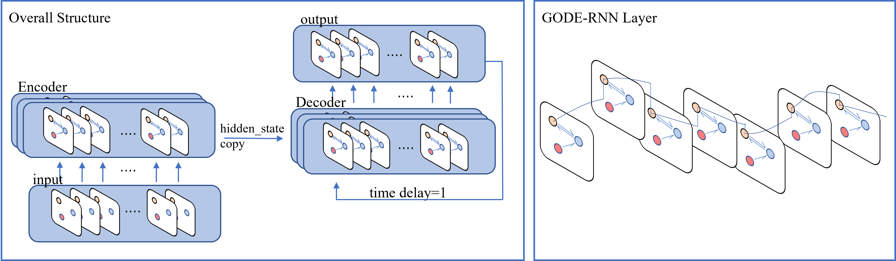
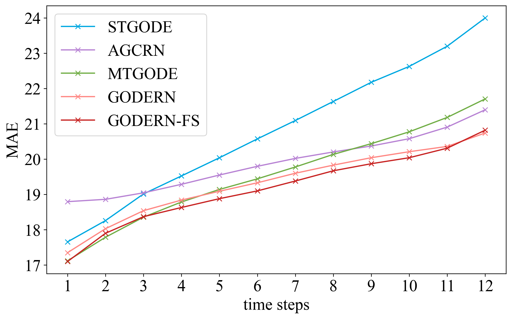
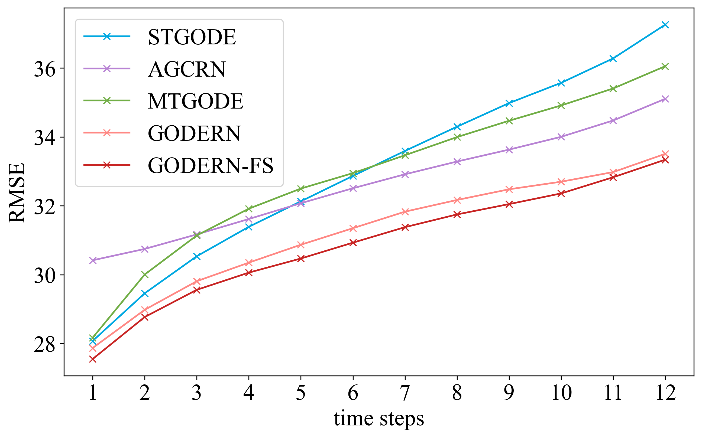
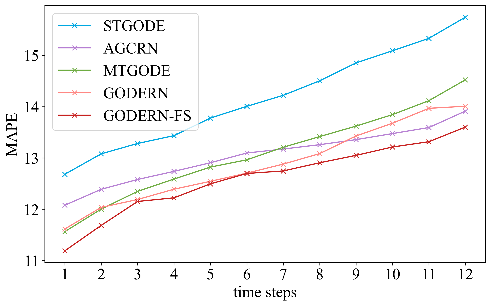

# GODERN
The PyTorch implementation of the paper "Learning Latent ODEs with Graph RNN for Multi-Channel Time Series Forecasting".

## Dependencies
> numpy==1.19.2
> scipy==1.5.4
> torch==1.7.1
> torchdiffeq==0.2.3

## Download datasets
* You can download the datasets [here](https://github.com/laiguokun/multivariate-time-series-data).
* Please put all dataset files under the `./data` directory.

## Reproducibility
* Here we provide the example: PEMS04.
* Run the shell scripts(`bash run.sh`)

If you want to try other datasets:
* Change the `--dataset=PEMS04` or `--dataset=PEMS08` in the `.run.sh` file.
* Change the num_nodes in the `./model/gode_rnn.conf` file. The default is the num_nodes of PEMS04.
* Run the shell scripts(`bash run.sh`)

## Results
* We provide the training process and results of PEMS04 under the `./runs` directory.
* The loss of each horizon is as follows:

